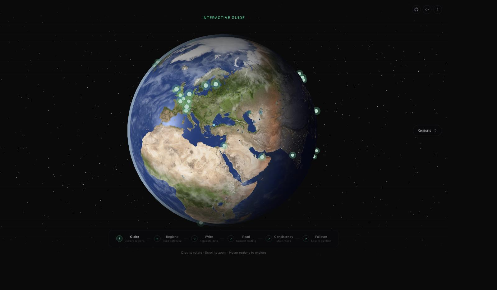

# Distributed Concepts

An interactive 3D curriculum that teaches distributed systems through guided,
step-by-step simulations on a living globe.



Start from the quiet globe home, browse the full curriculum at `/lessons`, or
jump directly to any available lesson. Shareable lessons use readable paths
such as `/lessons/stale-read`.

## Curriculum

The curriculum view organizes the course into four chapters:

1. Distribution changes the rules
2. Copies disagree
3. Agree through failure
4. Distribute the workload

Available interactive lessons open directly. Planned lessons remain visible so
the course direction is clear without presenting unfinished simulations as
complete.

## Interactive lessons

| # | Experience | What You Learn |
|---|-----------|----------------|
| 1 | **Build a Distributed Service** | A node accepts writes from clients through network messages |
| 2 | **Replicate the Data** | Copies bring reads closer but update asynchronously |
| 3 | **Follow a Write** | Request → leader commit → client acknowledgment → background replication |
| 4 | **Read from a Replica** | The router chooses the nearest copy and returns its local value |
| 5 | **Observe a Stale Read** | A read can reach a replica before the latest write does |
| 6 | **Recover from Failure** | Failure detection → leader election → reconnection → queued writes |

The simulations pause between meaningful system actions. You decide when to
acknowledge a commit, start replication, return a read, begin an election, and
resume traffic.

Browser Back and Forward move between the curriculum and lesson URLs without
reloading the globe. Opening an advanced lesson prepares the minimum valid
topology it needs while leaving skipped lessons incomplete.

## Tech Stack

- **Framework:** Next.js 16 (App Router) + React 19 + TypeScript
- **3D:** React Three Fiber + Drei + custom GLSL shaders
- **Styling:** Tailwind CSS v4
- **State:** Zustand v5
- **Animations:** Framer Motion (UI) + R3F useFrame (3D)

Everything is simulated client-side. No real database connection is needed.

## Getting Started

```bash
npm install
npm run dev
```

Open [http://localhost:3000](http://localhost:3000).

## Project Structure

```
src/
├── app/
│   ├── page.tsx                        : Curriculum home + all 6 interactive lessons
│   ├── lessons/                        : Crawlable curriculum and lesson routes
│   ├── layout.tsx                      : Root layout + OG metadata
│   └── globals.css                     : Tailwind v4, animations, branding
├── components/
│   ├── globe/                          : 3D components
│   │   ├── GlobeScene.tsx              : R3F Canvas wrapper
│   │   ├── Globe.tsx                   : GLSL shader Earth
│   │   ├── RegionMarker.tsx            : Region dots on globe
│   │   ├── ConnectionArc(s).tsx        : Arcs between regions
│   │   ├── DataPacket.tsx              : Animated traveling orb
│   │   ├── WriteFlowVisualization.tsx  : Write path animation
│   │   ├── ReadFlowVisualization.tsx   : Read path animation
│   │   ├── FailoverVisualization.tsx   : Recovery animation
│   │   └── ...                         : Heatmap, waves, markers, etc.
│   ├── panels/                         : Lesson panels and action rail
│   │   ├── FlowPanel.tsx               : Shared panel and LessonSequence
│   │   ├── RegionBuilder.tsx           : Replica placement UI
│   │   ├── WritePanel.tsx              : Guided write actions
│   │   ├── ReadPanel.tsx               : Guided read actions
│   │   ├── ConsistencyRacePanel.tsx    : Stale-read controls
│   │   ├── FailoverPanel.tsx           : Guided recovery actions
│   │   └── ...                         : Stats, timelines, comparisons
│   └── ui/                             : Shared UI
│       ├── LearningPathNav.tsx         : Bottom lesson navigation
│       ├── HomeIntro.tsx               : Quiet first-open globe controls
│       ├── CurriculumHome.tsx          : Chapter map and direct lesson entry
│       └── ...                         : Lesson nav, sound, loading
└── lib/
    ├── regions.ts                      : 36 AWS and GCP regions
    ├── steps.ts                        : Full curriculum + interactive lesson registry
    ├── geo-utils.ts                    : Lat/lon to 3D coordinate math
    ├── arc-utils.ts                    : Arc geometry calculations
    ├── sounds.ts                       : Sound effects
    ├── hooks/use-geolocation.ts        : Browser geolocation hook
    ├── simulation/latency.ts           : Distance-based latency estimation
    └── store/                          : Zustand stores
        ├── database-store.ts           : Leader and read-replica config
        ├── write-flow-store.ts         : Write lesson state
        ├── read-flow-store.ts          : Read lesson state
        ├── consistency-race-store.ts   : Consistency lesson state
        ├── failover-store.ts           : Recovery lesson state
        └── onboarding-store.ts         : Stable lesson progress persistence
```
